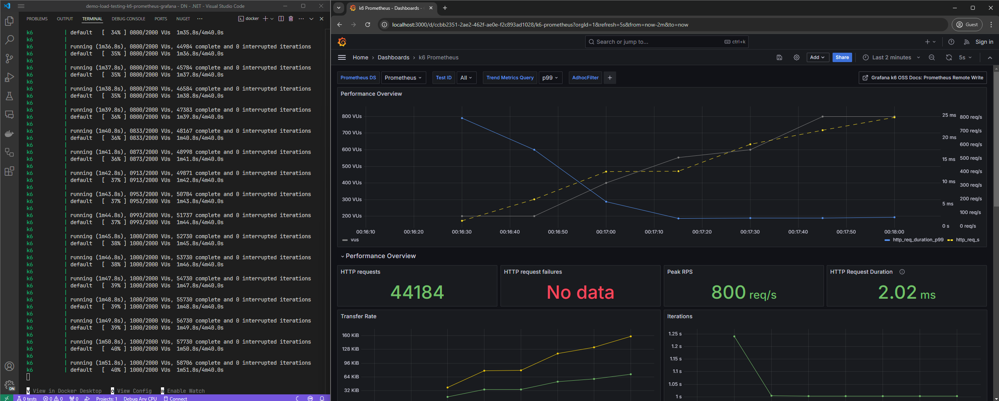

# Demo - Load Testing with K6, Prometheus and Grafana


## Components

- K6
- Prometheus
- Grafana


### Grafana

#### Dashboard
- k6 Prometheus
  - https://grafana.com/grafana/dashboards/19665-k6-prometheus/
  - Id: 19665
- k6 Prometheus (Native Histograms)
  - https://grafana.com/grafana/dashboards/18030-k6-prometheus-native-histograms/
  - Id: 18030




## Run the demo

```bash
docker compose up
```


## References

- [K6 and Prometheus](https://grafana.com/docs/k6/latest/results-output/real-time/prometheus-remote-write/)
- [Test samples](https://github.com/grafana/k6/tree/master/examples)
